# 练习题9

### Q1:
设有 5 个数据 $do, for, if, repeat, while$ ，他们排在一个有序表中，其查找概率分别是 $p_1 = 0.2, p_2 = 0.15, p_3 = 0.1, p_4 = 0.03, p_5 = 0.01$ ，而查找它们之间不存在的概率分别为 $q_0 = 0.2, q_1 = 0.15, q_2 = 0.2, q_3 = 0.03, q_4 = 0.02, q_5 = 0.01$ ，该有序表如下：

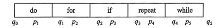

#### 答案：
1. 
顺序查找
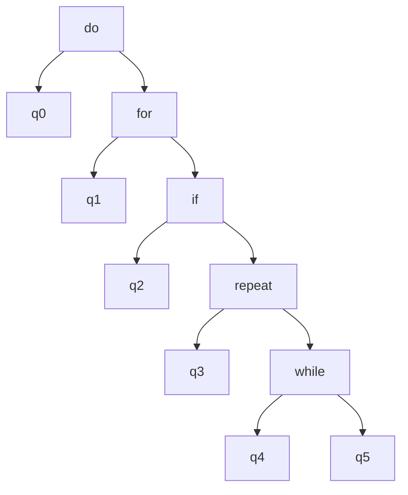

折半查找
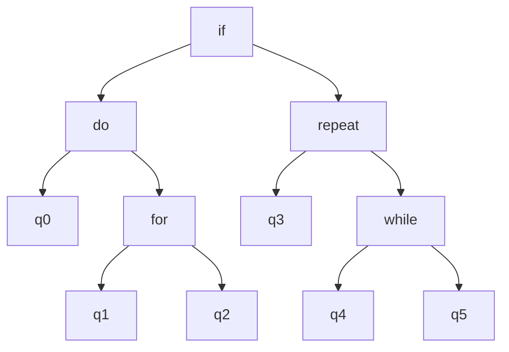

2. $ASL_1 = 0.97$  $ASL_2 = 1.07$

3. $ASL_1 = 1.04$  $ASL_2 = 1.3$

---

### Q2:
对于有序表 $A[0 .. 10]$ 在等概率的情况下求采用折半查找时成功和不成功的平均查找长度。对于有序表 (12, 18, 24, 35, 47, 50, 62, 83, 90, 115, 134) ，当用折半查找法 90 时需要进行多少词查找可确定成功？查找 47 时需要进行多少次查找可确定成功？查找 100 时需要进行多少次查找才能确定不成功？

#### 答案：
3, 3.67, 2, 4, 3

---

### Q3:
有以下查找算法：
```cpp
int fun(int a[], int n, int k) {
    for (int i = 0; i < n; i += 2) {
        if (a[i] == k) return i;
    }
    for (int i = 0; i < n; i += 2) {
        if (a[i] == k) return i;
    }
    return -1;
}
```

#### 答案：
1. 在 a[] 中查找 k 。
2. 4, 3
3. -1 8

---

### Q4:
假设一棵二叉排序树的关键字为单个字母，其后序遍历序列为 $ACDBFIJHGE$ ，回答以下问题：
1. 画出该二叉排序树。
2. 求在等概率情况下的查找成功的平均查找长度。
3. 求在等概率情况下的查找不成功的平均查找长度。

#### 答案：
1.
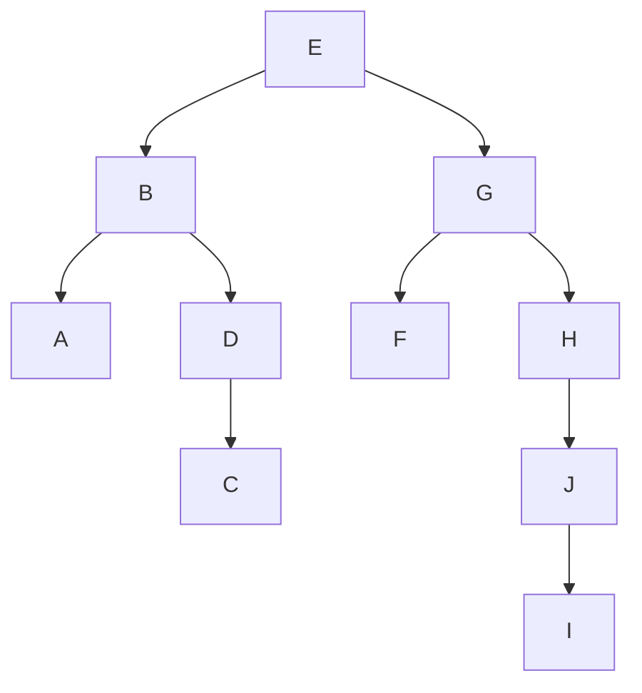

2. $ASL_1 = 3$

3. $ASL_2 = 3.64$

---

### Q5:
证明如果一棵非空二叉树（所有结点值均不相同）的中序遍历序列是从小到大有序的，则该二叉树是一棵二叉排序树。

#### 答案：
由于中序序列呈正序，则根结点的左子树值都小于根结点值，右子树均大于根结点值。符合二叉排序树定义。

---

### Q6:
由 23, 12, 45 关键字构成的二叉排序树有多少棵？其中属于平衡二叉树的有多少棵？

#### 答案：
3 1

---

### Q7:
将整数序列 (4, 5, 7, 2, 1, 3, 6) 中的元素依次插入一棵空的二叉排序树中，试构造相应的二叉排序树，要求用图形给出构造过程。

#### 答案：
<div style="display: flex; gap: 20px; flex-wrap: wrap;">

1. 
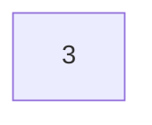

2. 
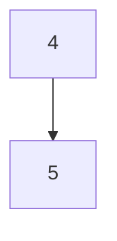

3.
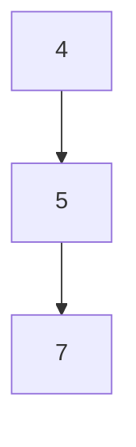

4.
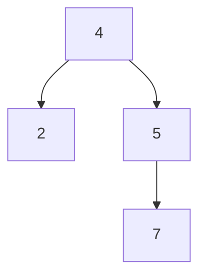

5.
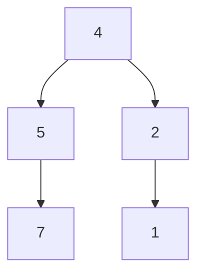

6.
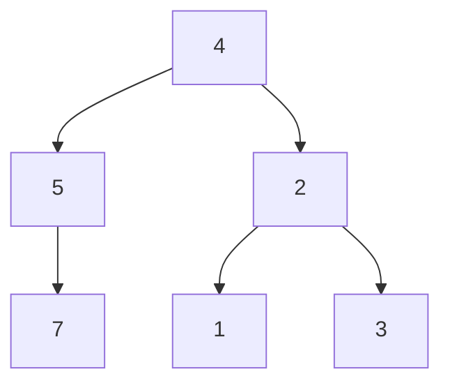

7.
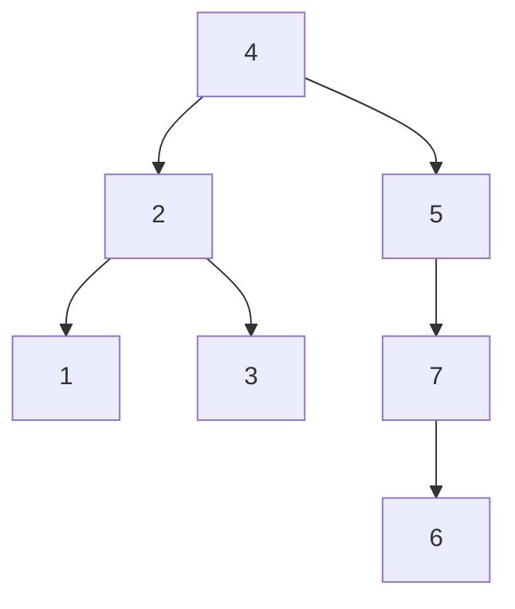
<div>

---

### Q8:
将整数序列 (4, 5, 7, 2, 1, 3, 6) 中的元素依次插入一棵空的二叉排序树中，试构造相应的二叉排序树，要求用图形给出构造过程。

#### 答案：
<div style="display: flex; gap: 20px; flex-wrap: wrap;">

1. 


2. 


3. 4 失衡


4. 左旋平衡
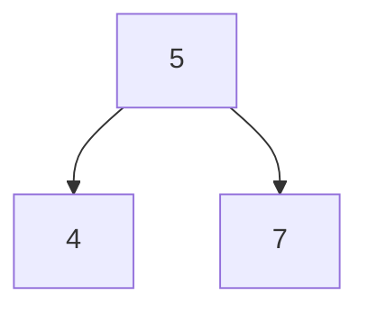
5.
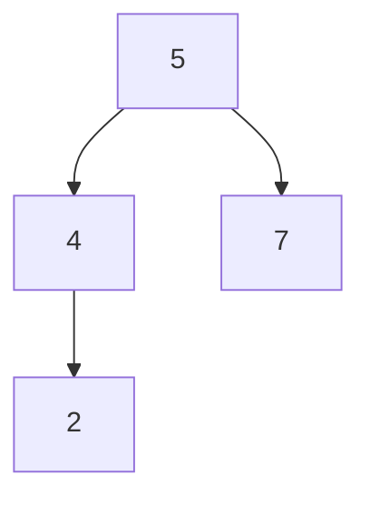

6. 4 失衡
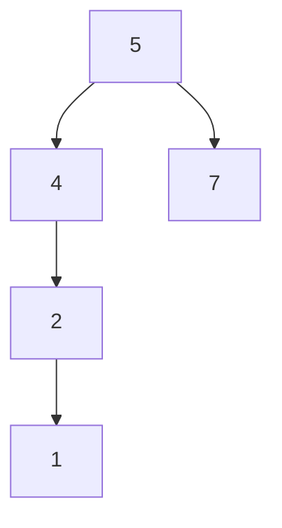

7. 右旋平衡
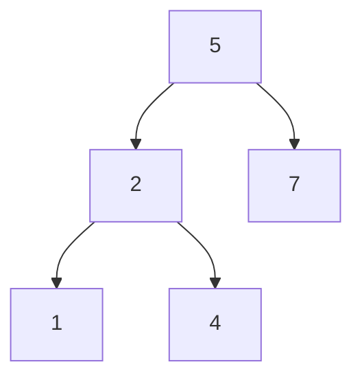

8. 5 失衡
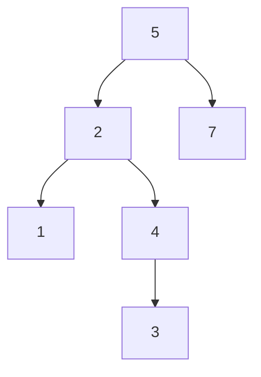

9. 先 2 左旋 5 再右旋
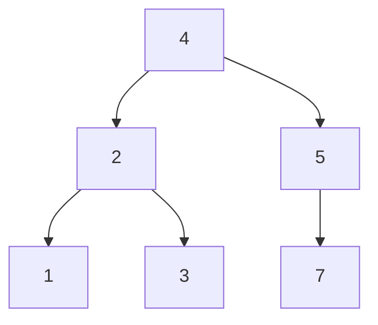

10. 5 失衡 


11. 5 左旋 
```mermaid
graph TD
    4-->2
    2-->1
    2-->3
    4-->7
    7-->5
    7-->6
```
<div>

---

### Q9:
有一个关键字序列为 (11, 14, 2, 7, 1, 15, 5, 8, 4) ，从一棵空红黑树开始依次插入各个关键字创建一棵红黑树，给出创建红黑树的这个过程。

#### 答案：
<div style="display: flex; gap: 20px; flex-wrap: wrap;">

1. 
```mermaid
graph TD;
    11;

    classDef redNode fill:#ff0000,color:#000000;
```

2.
```mermaid
graph TD;
    11-->14;

    class 14 redNode;
    classDef redNode fill:#ff0000,color:#000000;
```

3.
```mermaid
graph TD;
    11-->2;
    11-->14;

    class 2,14 redNode;
    classDef redNode fill:#ff0000,color:#000000;
```

4. 红色属性冲突
```mermaid
graph TD;
    11-->2;
    11-->14;
    2-->7;

    class 2,7,14 redNode;
    classDef redNode fill:#ff0000,color:#000000;
```

5. 结点 2, 11, 14 变色。根属性冲突
```mermaid
graph TD;
    11-->2;
    11-->14;
    2-->7;

    class 7,11 redNode;
    classDef redNode fill:#ff0000,color:#000000;
```

6. 结点 11 变色。
```mermaid
graph TD;
    11-->2;
    11-->14;
    2-->7;

    class 7 redNode;
    classDef redNode fill:#ff0000,color:#000000;
```

7. 
```mermaid
graph TD;
    11-->2;
    11-->14;
    2-->1;
    2-->7;

    class 1,7 redNode;
    classDef redNode fill:#ff0000,color:#000000;
```

8. 
```mermaid
graph TD;
    11-->2;
    11-->14;
    14-->15;
    2-->1;
    2-->7;

    class 1,7,15 redNode;
    classDef redNode fill:#ff0000,color:#000000;
```

8. 红色属性冲突
```mermaid
graph TD;
    11-->2;
    11-->14;
    14-->15;
    2-->1;
    2-->7;
    7-->5;

    class 1,5,7,15 redNode;
    classDef redNode fill:#ff0000,color:#000000;
```

9. 结点 1, 2, 7 变色
```mermaid
graph TD;
    11-->2;
    11-->14;
    14-->15;
    2-->1;
    2-->7;
    7-->5;

    class 2,5,15 redNode;
    classDef redNode fill:#ff0000,color:#000000;
```

10.
```mermaid
graph TD;
    11-->2;
    11-->14;
    14-->15;
    2-->1;
    2-->7;
    7-->5;
    7-->8;

    class 2,5,8,15 redNode;
    classDef redNode fill:#ff0000,color:#000000;
```

11. 红色属性冲突
```mermaid
graph TD;
    11-->2;
    11-->14;
    14-->15;
    2-->1;
    2-->7;
    7-->5;
    7-->8;
    5-->4;

    class 2,4,5,8,15 redNode;
    classDef redNode fill:#ff0000,color:#000000;
```

12. 结点 5, 7, 8 变色。继续冲突
```mermaid
graph TD;
    11-->2;
    11-->14;
    14-->15;
    2-->1;
    2-->7;
    7-->5;
    7-->8;
    5-->4;

    class 2,4,7,15 redNode;
    classDef redNode fill:#ff0000,color:#000000;
```

12. 左旋结点 2 ，结点 7, 11 变色，右旋结点 11
```mermaid
graph TD;
    11-->8;
    11-->14;
    14-->15;
    2-->1;
    2-->5;
    7-->2;
    7-->11;
    5-->4;

    class 2,4,11,15 redNode;
    classDef redNode fill:#ff0000,color:#000000;
```

---

### Q10:
已知一棵 5 阶 B 树中有 53 个关键字，则树的最大高度是多少？

#### 答案：
4 + 1 = 5

---

### Q11:
设有一组关键字 (19, 1, 23, 14, 55, 20, 84, 27, 68, 11, 10, 77)，其哈希函数为 $h(key) = key % 13$ 。采用开放地址法中的线性探测法解决冲突，试在 0 ~ 18 的哈希表中对该关键字序列构造哈希表，并求成功和不成功的情况下的平均查找长度。

#### 答案：
1.92, 4.46

---

### Q12:
设计一个折半查找算法，求查找到关键字为 $k$ 的记录所需关键字的比较次数。假设 $k$ 与 $R[i].key$ 比较得到 3 种情况，即 $k == R[i].key, k < R[i].key$ 或者 $k > R[i].key$ ，记为一次比较（在教材中讨论关键字比较次数都是这样假设的）。 

#### 答案：
```cpp
void BSLength(int arr[], int n, int key) {
    int low = 0, high = n - 1, mid, length;
    while (low != high) {
        mid = (low + high) / 2;
        if (arr[mid] < key)
            low = mid + 1;
        else if (arr[mid] > key)
            high = mid - 1;
        else
            return length;
        ++length;
    }
    return length - 1;
}
```

---

### Q13:
设计一个算法，判断给定的二叉树是否为二叉树，假设二叉树中结点关键字均为正整数且均不相同。

#### 答案：
```cpp
bool IsBSTree(BtNode<int>* root) {
  if (!root) return true;
  if ((!root->left || root->data > root->left->data) &&
      (!root->right || root->data < root->right->data) &&
      IsBSTree(root->left) && IsBSTree(root->right))
    return true;
  else
    return false;
}

```

---

### Q14:
设计一个算法，在非空二叉排序树 $bt$ 中求出指定关键字为 $k$ 的结点的层次。
```cpp
int Level(BtNode<int>& bt, int k) {
    return bt.Depth(bt.Find(k)) + 1;
}
```

---

### Q15:
设计一个哈希表 $ha[0..m - 1]$ 存放 $n$ 个元素，哈希函数采用除留余数法，哈希函数为 $H(key) = key % p(p \le m)$ ，解决冲突采用开放地址法的平方探测法。

1. 设计哈希表的类型。
2. 设计在哈希表中查找指定关键字的算法。

#### 答案：
```cpp
enum Status { EMPTY, OCCUPIED, DELETED };
template <typename T>
struct LPNode {
  int key;
  T data;
  Status status = EMPTY;
};

template <typename T, size_t CAPACITY>
class LPTable {
  using Node = LPNode<T>;

 private:
  Node table[CAPACITY];

 public:
  Node& Search(const int& key) {
    int adr = Hash(key), count = 0;
    int first_deleted = -1;
    while (table[adr].status != EMPTY) {
      if (table[adr].status == OCCUPIED && table[adr].key == key) break;
      if (first_deleted == -1 && table[adr].status == DELETED)
        first_deleted = adr;
      ++count;
      adr = (adr + count * count) % CAPACITY;
    }
    if (table[adr].key != key)
      if (first_deleted != -1) adr = first_deleted;
    table[adr].key = key;
    table[adr].status = OCCUPIED;
    return table[adr];
  }

};
```

---
