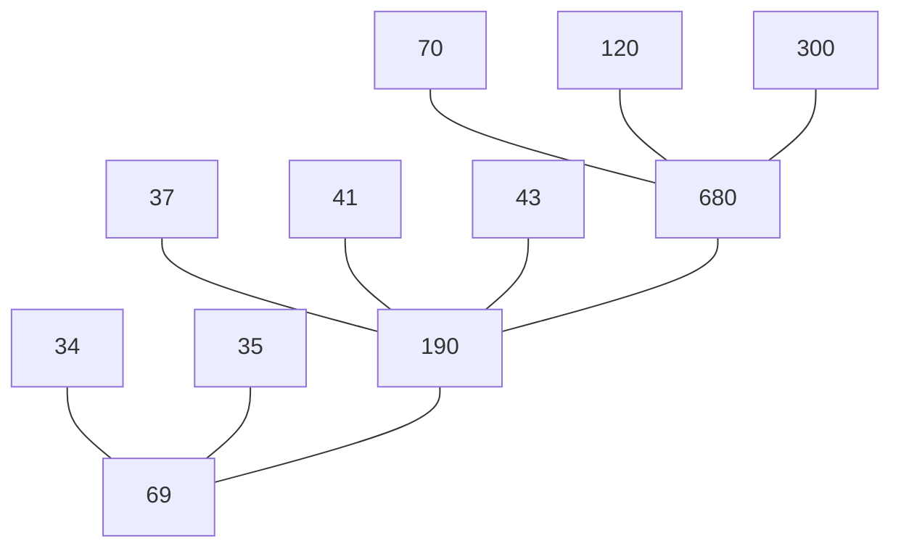

# 练习题11

### Q1:
外排序中两个相对独立的阶段是什么？

#### 答案：
生成若干有序初始段，多路归并排序。

---

### Q2:
给出一组关键字 $T = {12, 2, 16, 30, 8, 28, 4, 10, 20, 6, 18}$ ，设内存工作区中可容纳 4 个记录，给出用置换-选择排序算法可产生多少个初始归并段？

#### 答案：
{2, 8, 12, 16, 28, 30}
{4, 6, 10, 18, 20}

---

### Q3:
设输入的关键字满足 $k_1 > k_2 > ... > k_n$ ，内存工作区的大小为 $m$ ，用置换-选择排序算法可产生多少个初始归并段？

#### 答案：
$\lceil m / n \rceil$

---

### Q4:
什么是多路平衡归并？多路平衡归并的目的是什么？

#### 答案：
将 $m$ 个初始段归并排序为 $\lceil m / k \rceil$ 个归并段，直至归并成一个初始段，叫做 $k$ 路平衡归并。目的是减少归并趟数。

---

### Q5:
什么是败者树？其主要作用是什么？用于 $k$ 路归并的败者树公有多少个结点（不记冠军结点）？

#### 答案：
败者树就是类似小顶堆，叶子结点存储记录，而其他结点存储关键字对应的段号，用来快速得到当前内存中最小记录。有 $2k - 1$ 个结点。

---

### Q6:
如果某个文件经内排序的到 80 个初始归并段，试问：
1. 若使用多路平衡归并执行 3 趟完成排序，那么可取的归并路数至少为多少？
2. 如果操作系统要求一个程序同时可用的输入 / 输出文件的总数不超过 15 个，则按多路平衡归并至少需要几趟可以完成排序？如果限定这个趟数，可取的最少路数是多少？

#### 答案：
1. 5 路
2. 2 趟，14 路。

---

### Q7:
若采用置换-选择排序算法得到 8 个初始归并块，它们的记录个数分别为 37, 34, 300, 41, 70, 120, 35 和 43 ，画出这些磁盘文件进行归并的 4 阶最佳归并树，计算出总的读写记录数。

#### 答案：

1878

---

