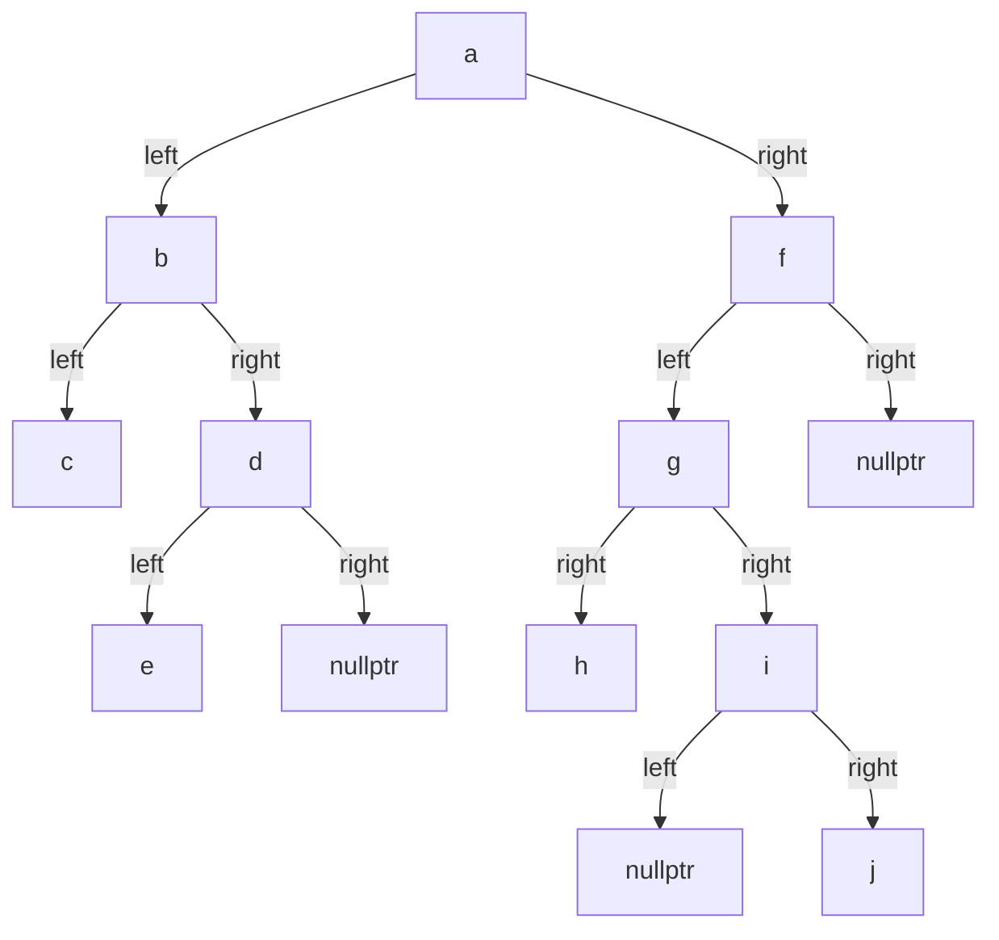
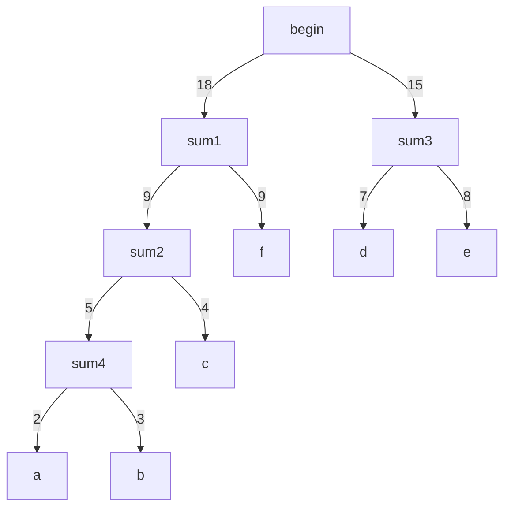

# 练习题7

### Q1:
有一棵树的括号表示为 $A(B, C(E, F(G)), D)$ ，回答下面的问题：
1. 指出树的根节点。
2. 指出这棵树的所有叶子节点。
3. 节点 $C$ 的度是多少？
4. 这棵树的度是多少？
5. 这棵树的高度是多少？
6. 结点 $C$ 的孩子结点是那些？
7. 结点 $C$ 的双亲结点是谁？

#### 答案：
1. $A$
2. $B, D, E, G$
3. 2
4. 3
5. 4
6. $E, F$
7. $A$

---

### Q2:
若一棵度为 4 的树中度为 2、3、4 的结点个数分别为 3、2、2 ，则该树的叶子结点的个数是多少？

#### 答案：
由
$$
n = n_1 + n_2 + n_3 + n_4 + n_0 \\
r = n_1 + 2 * n_2 + 3 * n_3 + 4 * n_4 \\
r = n - 1 \\
$$
可得：$n_0 = 14$

---

### Q3:

为了实现以下各种功能， $x$ 结点表示该结点的位置，给出树的最合适的存储结构：
1. 求 $x$ 和 $y$ 结点的最近祖先结点。
2. 求 $x$ 结点的所有子孙结点。
3. 求根结点到 $x$ 结点的路径。
4. 求 $x$ 结点的右边兄弟结点。
5. 判断 $x$ 结点是否为叶子结点.
6. 求 $x$ 的所有孩子结点.

#### 答案：
1. 双亲存储结构
2. 孩子链存储结构
3. 双亲存储结构
4. 孩子兄弟链存储结构
5. 孩子链存储结构
6. 孩子链存储结构

---

### Q4:
设二叉树 $bt$ 的一种存储结构如下：
|  $code$  | 1 | 2 | 3 | 4 | 5 | 6 | 7 | 8 | 9  | 10 |
| -------- |---|---|---|---|---|---|---|---|----|----|
| $lchild$ | 0 | 0 | 2 | 3 | 7 | 5 | 8 | 0 | 10 | 1  |
|  $data$  | j | h | f | d | b | a | c | e | g  | i  |
| $rchild$ | 0 | 0 | 0 | 9 | 4 | 0 | 0 | 0 | 0  | 0  |

其中, $bt$ 为树根结点指针, $lchild, rchild$ 分别为结点的左、右孩子指针域，在这里使用结点编号作为指针域值； 0 表示指针域值为空； $data$ 为结点的数据域。请完成下列各题：
1. 画出二叉树 $bt$ 的树形表示。
2. 写出按先序、中序、后序遍历二叉树 $bt$ 所得到的结点序列。
3. 画出二叉树 $bt$ 的后序线索树（不带头结点）。

#### 答案：
1. $bt$ 树形表示：
    ```mermaid
    graph TD;
        a -->|left| b;
        a ----->|right| v1[nullptr];
        b --->|left| c;
        b -->|right| d;
        d -->|left| f;
        d -->|right| g;
        f -->|left| h;
        f -->|right| v2[nullptr];
        c -->|left| e;
        c -->|right| v3[nullptr];
        g -->|left| i;
        g -->|right| v4[nullptr];
        i -->|left| j;
        i -->|right| v5[nullptr];
    ```

2. 先序序列：$abcedfhgij$ <br>
   中序序列：$ecbhfdjiga$ <br>
   后序序列：$echfjigdba$

3. 后序线索树：（图不好画）
    ```dot
    digraph BinaryTree {
        node [shape=circle]; // 设置节点为圆形

        a -> b [label="left"];
        b -> c [label="left"];
        b -> d [label="right"];
        d -> f [label="left"];
        d -> g [label="right"];
        f -> h [label="left"];
        c -> e [label="left"];
        g -> i [label="left"];
        i -> j [label="left"];

        e -> c [style=dashed]; 
        c -> h [style=dashed]; 
        h -> f [style=dashed]; 
        f -> j [style=dashed]; 
        j -> i [style=dashed]; 
        i -> g [style=dashed]; 
        g -> d [style=dashed]; 
    }
    ```

---

### Q5:
含有 60 个叶子结点的二叉树的最小高度是多少？

#### 答案：
$\lceil log_{2}(60) \rceil + 1 = 7$

---

### Q6:
已知完全二叉树的第 6 层（设根节点为第 1 层）有 8 个叶子结点，则该完全二叉树的结点个数最大是多少？最少是多少？

#### 答案：
最大是 111 ,最小是 39 。

---

### Q7:
已知一棵满二叉树的结点个数为 20 ~ 40 ，此二叉树的叶子结点有多少个？

#### 答案：
16

---

### Q8:
已知一棵二叉树的中序序列为 $cbedahgijf$ 、后序序列为 $cedbhjigfa$ ，给出该二叉树的树形表示。

#### 答案：


---

### Q9:
给定 6 个字符 $a \sim f$ ，他们的权值集合 $W = \{2, 3, 4, 7, 8, 9 \}$ ，试构造关于 $W$ 的一棵哈夫曼树，求其带权路径长度 $WPL$ 和各个字符的哈夫曼编码。

#### 答案：


$WPL = 4 * (2 + 3) + 3 * 4 + 2 * 9 + 2 * (7 + 8) = 80$

```
a = 0000
b = 0001
c = 001
d = 10
e = 11
f = 01
```

---

### Q10:
假设有 9 个结点，编号为 1 ~ 9 ，初始并查集为 $S$ = {{1}, {2}, {3}, {4}, {5}, {6}, {7}, {8}, {9}} ，给出在 $S$ 上执行以下一系列并查集运算的过程和结果：
$Union(1,2)$, $Union(3, 4)$, $Union(5, 6)$, $Union(7, 8)$, $Union(2, 4)$, $Union(8, 9)$, $Union(6, 8)$, $Find(5)$, $Union(4, 8)$, $Find(1)$ 。在合并中两个子集树秩相同时以编号较大的结果作为根结点。

#### 答案：
```
S = {{1, 2}, {3}, {4}, {5}, {6}, {7}, {8}, {9}}
S = {{1, 2}, {3, 4}, {5}, {6}, {7}, {8}, {9}}
S = {{1, 2}, {3, 4}, {5, 6}, {7}, {8}, {9}}
S = {{1, 2}, {3, 4}, {5, 6}, {7, 8}, {9}}
S = {{1, 2, 3, 4}, {5, 6}, {7, 8}, {9}}
S = {{1, 2, 3, 4}, {5, 6}, {7, 8, 9}}
S = {{1, 2, 3, 4}, {5, 6, 7, 8, 9}}
Find(5) = 5
S = {{1, 2, 3, 4, 5, 6, 7, 8, 9}}
Find(1) = 1
```

---


### Q11:
假设二叉树中的每个结点值为单个字符，设计一个算法，将一棵以二叉链方式存储的二叉树 $t$ 转换成对应的顺序存储结构 $a$ 。

#### 答案：
```cpp
int Transform(const Btree& t, int arr[]) {
  int length = 0;
  LinkQueue<BtNode*> temp;
  BtNode* cur = t.GetRoot();
  while (cur != nullptr) {
    arr[length++] =  cur->data;
    while (arr[length] != '#') ++length;
    if (cur->lchild != nullptr)
      temp.EnQueue(cur->lchild);
    else
      arr[length * 2 - 1] = '#';
    if (cur->rchild != nullptr)
      temp.EnQueue(cur->rchild);
    else
      arr[length * 2] = '#';
    cur = (t.Size() != 0) ? temp.DeQueue() : nullptr;
  }
  return length;
}
```

---

### Q12:
假设二叉树中的每个结点值为单个字符，采用顺序存储结构存储。设计一个算法，求二叉树 $t$ 中的叶子结点个数。

#### 答案：
```cpp
int LeaveCount(BTree& t) {
  int count = 0;
  for (int i = 0; i < t.Size(); ++i) {
    if (t[i] != '#' && 2 * i + 1 >= t.Size()
      || (t[2 * i + 1] == '#' && t[2 * i + 2] == '#')) 
        ++count;
  }
  return count;
}
```

---

### Q13:
假设二叉树中的每个结点为单个字符，采用二叉链存储结构存储。设计一个算法，计算一棵给定二叉树 $b$ 中的所有单分支结点个数。

#### 答案：
```cpp
void SingleNodeCount(BtNode* root, int& count = 0) {
  if (root->lchild ^ root->rchild) ++count;
  if (root->lchild) SingleNodeCount(root->lchild, count);
  if (root->rchild) SingleNodeCount(root->rchild, count);
}
```

---

### Q14:
假设二叉树中的每个结点值为单个字符，采用二叉链存储结构。设计一个算法，求二叉树 $b$ 中的最小结点值。

#### 答案：
```cpp
void Min(BtNode* root, char& min = 0) {
  min = (min < root->data) ? min : root->data;
  if (root->lchild) Min(root->lchild, min);
  if (root->rchild) Min(root->rchild, min);
}
```

---

### Q15:
假设二叉树中的每个结点值为单个字符，采用二叉链存储结构存储。设计一个算法，将二叉链 $b1$ 复制到二叉链 $b2$ 中。

#### 答案：
```cpp
void Copy(const BtNode*& b1_root, const BtNode*& b2_root) {
  if (!b1_root) return;
  b2_root = new Node(b1_root->data);
  Copy(b1_root->left, b2_root->left);
  Copy(b1_root->rchild, b2_root->rchild);
}
```

---

### Q16:
假设二叉树中的每个结点值为单个字符，采用二叉链存储结构存储。设计一个算法，求二叉树 $b$ 中第 $k$ 层上的叶子结点个数。

#### 答案：
```cpp
int CountKthLevelLeaves(const BtNode* root, const unsigned k) {
  if (k == 1) {
    if (!root->lchild && !root->rchild) 
      return 1;
    return 0;
  }
  int sum = 0;
  if (root->lchild) sum += CountKthLevelLeaves(root->lchild, k - 1);
  if (root->rchild) sum += CountKthLevelLeaves(root->rchild, k - 1);
  return sum;
}
```

### Q17:
假设二叉树中的每个结点值为单个字符，采用二叉链存储结构存储。设计一个算法，判断值为 $x$ 的结点与值为 $y$ 的结点是否互为兄弟，假设这样的结点值是唯一的。

#### 答案：
```cpp
bool IsBrother(const BtNode* t, const char& x, const char& y) {
  if (root->lchild && root->rchild && (root->lchild->data == x || root->lchild->data == y)) {
    compare_brother = [x, y](BtNode* left, BtNode* right) { return left->data == x && right->data == y; };
    return compare_brother(root->lchild, root->rchild) || compare_brother(root->rchild, root->lchild);
  }
  bool is_brother = 0;
  if (root->lchild) is_brother |= IsBrother(root->lchild, x, y);
  if (root->rchild) is_brother |= IsBrother(root->rchild, x, y);
  return is_brother;
}
```

### Q18:
假设二叉树中的每个结点值为单个字符，采用二叉链存储结构存储。设计一个算法，采用先序遍历方法求二叉树 $b$ 中值为 $x$ 的结点的子孙结点，假设值为 $x$ 的结点是唯一的。

#### 答案：
```cpp
void Output(const BtNode* root) {
  if (!root) return;
  cout << root->data;
  Output(root->lchild);
  Output(root->rchild);
}

void Find(const BtNode* root, const char& x) {
  if (!root) return;
  if (root->data == x) Output(root);
  Find(root->lchild, x);
  Find(root->rchild, x);
}
```

---

### Q19:
假设二叉树采用二叉链存储结构，设计一个算法把二叉树 $b$ 的左右子树进行交换，要求不破坏原二叉树。

#### 答案：
```cpp
void Swap(const BtNode* b_root, BtNode* t_root) {
  t_root->lchild = nullptr, t_root->rchild = nullptr;
  t_root->data = b_root->data;
  if (root->lchild) {
    b2_root->rchild = new BtNode;
    Swap(root->lchild, b2_root->rchild);
  }
  if (root->rchild) {
    b2_root->lchild = new BtNode;
    Swap(root->rchild, b2_root->lchild);
  }
}
```

---

### Q20:
假设二叉树采用二叉链存储结构，设计一个算法判断一棵二叉树 $b$ 的左、右子树是否同构。

#### 答案：
```cpp
bool IsIsomorphic(BtNode* b1, BtNode* b2) {
  if (!b1 && !b2)
    return true;
  else if (!b1 || !b2)
    return false;
  return IsIsomorphic(b1->lchild, b1->rchild) & IsIsomorphic(b2->lchild, b2->rchild);
}

bool IsIsomorphic(BtNode* b) {
  if (!b) return true;
  return IsIsomorphic(b->lchild, b->rchild);
}
```

---

### Q21:
假设二叉树以二叉链存储，设计一个算法判断一棵二叉树 $b$ 是否为完全二叉树。

#### 答案：
```cpp
bool IsComplete(const Btree& b) {
  int* arr = new BtNode*[pow(2, b.Depth())];
  int length = Transform(b.GetRoot(), arr);
  for (int i = 0; i < length - pow(2, b.Depth() - 1); ++i) {
    if (arr[i] == '#') return false;
  }
  return true;
}
```

---
