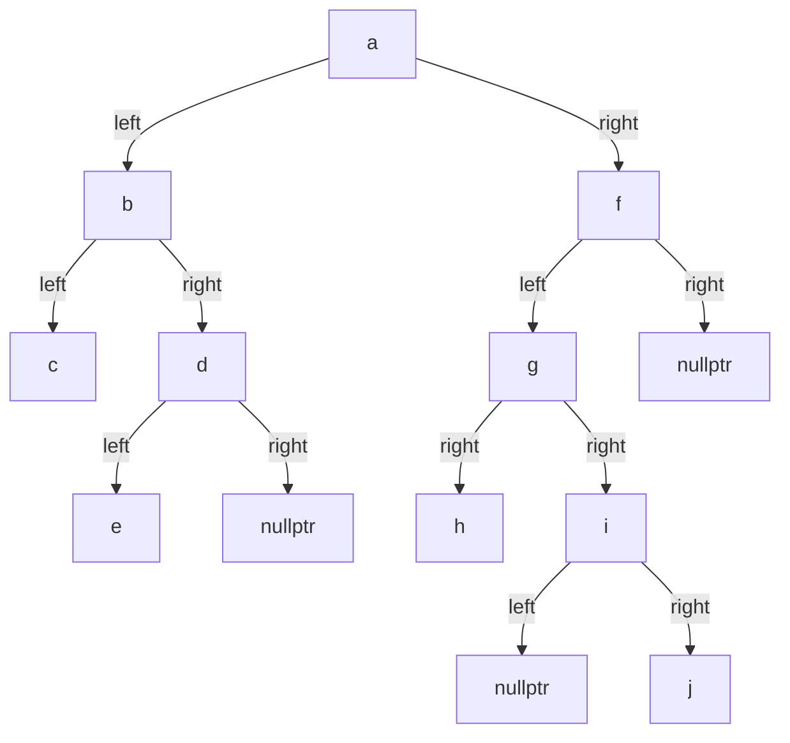
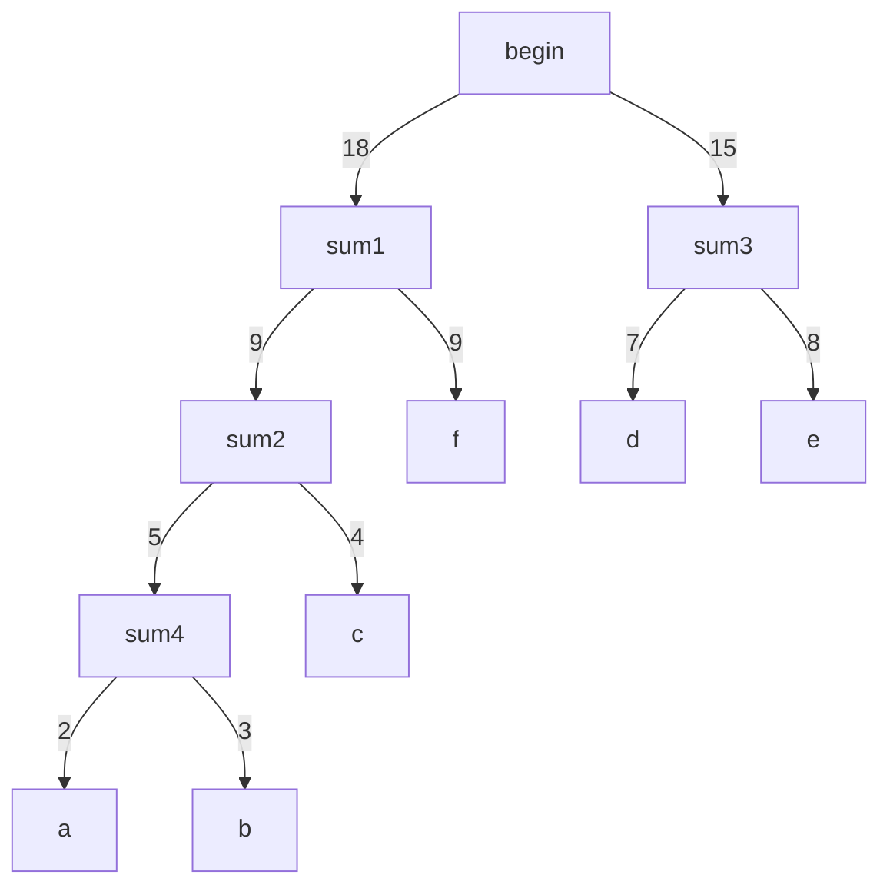

# 练习题7

### Q1:
有一棵树的括号表示为 $A(B, C(E, F(G)), D)$ ，回答下面的问题：
1. 指出树的根节点。
2. 指出这棵树的所有叶子节点。
3. 节点 $C$ 的度是多少？
4. 这棵树的度是多少？
5. 这棵树的高度是多少？
6. 结点 $C$ 的孩子结点是那些？
7. 结点 $C$ 的双亲结点是谁？

#### 答案：
1. $A$
2. $B, D, E, G$
3. 2
4. 3
5. 4
6. $E, F$
7. $A$

---

### Q2:
若一棵度为 4 的树中度为 2、3、4 的结点个数分别为 3、2、2 ，则该树的叶子结点的个数是多少？

#### 答案：
由
$$
n = n_1 + n_2 + n_3 + n_4 + n_0 \\
r = n_1 + 2 * n_2 + 3 * n_3 + 4 * n_4 \\
n = r - 1 \\
$$
可得：$n_0 = 12$

---

### Q3:

为了实现以下各种功能， $x$ 结点表示该结点的位置，给出树的最合适的存储结构：
1. 求 $x$ 和 $y$ 结点的最近祖先结点。
2. 求 $x$ 结点的所有子孙结点。
3. 求根结点到 $x$ 结点的路径。
4. 求 $x$ 结点的右边兄弟结点。
5. 判断 $x$ 结点是否为叶子结点.
6. 求 $x$ 的所有孩子结点.

#### 答案：
1. 双亲存储结构
2. 孩子链存储结构
3. 双亲存储结构
4. 孩子兄弟链存储结构
5. 孩子链存储结构
6. 孩子链存储结构

---

### Q4:
设二叉树 $bt$ 的一种存储结构如下：
|  $code$  | 1 | 2 | 3 | 4 | 5 | 6 | 7 | 8 | 9  | 10 |
| -------- |---|---|---|---|---|---|---|---|----|----|
| $lchild$ | 0 | 0 | 2 | 3 | 7 | 5 | 8 | 0 | 10 | 1  |
|  $data$  | j | h | f | d | b | a | c | e | g  | i  |
| $rchild$ | 0 | 0 | 0 | 9 | 4 | 0 | 0 | 0 | 0  | 0  |

其中, $bt$ 为树根结点指针, $lchild, rchild$ 分别为结点的左、右孩子指针域，在这里使用结点编号作为指针域值； 0 表示指针域值为空； $data$ 为结点的数据域。请完成下列各题：
1. 画出二叉树 $bt$ 的树形表示。
2. 写出按先序、中序、后序遍历二叉树 $bt$ 所得到的结点序列。
3. 画出二叉树 $bt$ 的后序线索树（不带头结点）。

#### 答案：
1. $bt$ 树形表示：
    ```mermaid
    graph TD;
        a -->|left| b;
        a ----->|right| v1[nullptr];
        b --->|left| c;
        b -->|right| d;
        d -->|left| f;
        d -->|right| g;
        f -->|left| h;
        f -->|right| v2[nullptr];
        c -->|left| e;
        c -->|right| v3[nullptr];
        g -->|left| i;
        g -->|right| v4[nullptr];
        i -->|left| j;
        i -->|right| v5[nullptr];
    ```

2. 先序序列：$abdfhgijce$ <br>
   中序序列：$hfdjigbeca$ <br>
   后序序列：$hfjigdecba$

3. 后序线索树：
    ```mermaid
    graph TD;
        %% Binary Tree Structure
        a --> b;
        b --> c;
        b --> d;
        d --> f;
        d --> g;
        f --> h;
        c --> e;
        g --> i;
        i --> j;

        %% Threads (dashed lines)
        h -.-> f;
        f -.-> d;
        j -.-> i;
        i -.-> g;
        g -.-> d;
        e -.-> c;
        c -.-> b;
    ```

---

### Q5:
含有 60 个叶子结点的二叉树的最小高度是多少？

#### 答案：
$\lceil log_{2}(60) \rceil + 1$

---

### Q6:
已知完全二叉树的第 6 层（设根节点为第 1 层）有 8 个叶子结点，则该完全二叉树的结点个数最大是多少？最少是多少？

#### 答案：
最大是 111 ,最小是 39 。

---

### Q7:
已知一棵满二叉树的结点个数为 20 ~ 40 ，此二叉树的叶子结点有多少个？

#### 答案：
5

---

### Q8:
已知一棵二叉树的中序序列为 $cbedahgijf$ 、后序序列为 $cedbhjigfa$ ，给出该二叉树的树形表示。

#### 答案：


---

### Q9:
给定 6 个字符 $a \sim f$ ，他们的权值集合 $W = \{2, 3, 4, 7, 8, 9 \}$ ，试构造关于 $W$ 的一棵哈夫曼树，求其带权路径长度 $WPL$ 和各个字符的哈夫曼编码。

#### 答案：


$WPL = 4 * (2 + 3) + 3 * 4 + 2 * 9 + 2 * (7 + 8) = 80$

```
a = 0000
b = 0001
c = 001
d = 10
e = 11
f = 01
```

---

###
