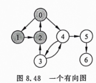

# 练习题8

### Q1:
图 $G$ 是一个非连通图，共有 28 条边，则该图最少有多少个顶点？

#### 答案：
要求最少顶点，完全图能以最少顶点容纳最多边，顶点数为 8 的完全图可以容纳 28 条边。又由于这是非连通图，额外加一个孤立顶点，共有 9 个顶点。

---

### Q2:
有一个如图 8.48 所示的有向图，给出其所有的强连通分量。



#### 答案：
{{0, 1, 2, 3, 4}, {5}, {6}}

---

### Q3:
对于稠密图和稀疏图，采用邻接矩阵和邻接表哪个更好一些？

#### 答案：
对于稠密图，使用邻接矩阵；对于稀疏图，使用邻接表，因为边比较少。

---

### Q4:
对于有 $n$ 个顶点的无向图和有向图（均为不带权图），在采用邻接矩阵和邻接表表示时如何求解以下问题：
1. 图中有多少条边。
2. 任意两个顶点 $i$ 和 $j$ 之间是否有边相连？
3. 任意一个顶点的度是多少？

#### 答案：
1. 计算每个结点边的和，加起来, 无向图要额外除 2。
2. 先找到 $i$ 结点，在遍历它的全部边，看是否有 $j$ 。
3. 找到某个结点，统计它的边数。

---

### Q5:
对于如图 8.49 所示的一个无向图 $G$，给出以顶点 0 作为初始点的所有的深度优先遍历序列和广度优先遍历序列。


#### 答案：
深度优先：
```
{0, 1, 4, 5, 2, 3}
{0, 1, 5, 4, 2, 3}
{0, 1, 4, 5, 3, 2}
{0, 1, 4, 5, 3, 2}
{0, 2, 3, 1, 4, 5}
{0, 2, 3, 1, 5, 4}
{0, 2, 1, 4, 5, 3}
{0, 2, 1, 5, 4, 3}
{0, 3, 2, 1, 4, 5}
{0, 3, 2, 1, 5, 4}
{0, 3, 1, 4, 5, 2}
{0, 3, 1, 5, 4, 2}
```

广度优先：
```
{0, 1, 2, 3, 4, 5}
{0, 2, 3, 1, 4, 5}
{0, 3, 2, 1, 4, 5}
{0, 1, 3, 2, 4, 5}
{0, 2, 1, 3, 4, 5}
{0, 3, 1, 2, 4, 5}
{0, 1, 2, 3, 5, 4}
{0, 2, 3, 1, 5, 4}
{0, 3, 2, 1, 5, 4}
{0, 1, 3, 2, 5, 4}
{0, 2, 1, 3, 5, 4}
{0, 3, 1, 2, 5, 4}
```

---

### Q6:
对于如图 8.50 所示的带权无向图，给出利用 $Prim$ 算法（从顶点 0 开始构建）和 $Kruskal$ 算法构造出的最小生成树的结果，要求结果按构造边的顺序列出。


#### 答案：
$Prim$ 算法：{<0, 1>, <0, 3>, <1, 2>, <2, 5>, <5, 4>}
$Kruskal$ 算法：{<0, 1>, <0, 3>, <1, 2>, <4, 5>, <2, 5>}

---

### Q7:
对于一个顶点个数超过 4 的带权无向图，回答以下问题：
1. 该图的最小生成树一定是唯一的吗？如果所有边的权都不相同，那么其最小生成树一定是唯一的吗？
2. 如果该图的最小生成树不是唯一的，那么调用 Prim 算法和 Kruskal 算法构造出的最小生成树一定相同吗？
3. 如果途中有且仅有两条权最小的边，他们一定出现在该图的所有最小生成树中吗？
4. 如果途中有且仅有 3 条权最小的边，它们一定出现在该图的所有最小生成树中吗？

简要说明理由。

#### 答案：
1. 不一定，可以有多个。一定，因为结点为 n - 1 且权值最小的树只有一个, 一旦选择其他边权值一定不为最小, 矛盾 。
2. 不一定，选择最短边的次序可能不一样。
3. 一定，因为包含这两个边的树才是权值最小。
4. 不一定，因为三条边就可能出现其中一个边的两个顶点已经通过另两个边加入，这个边将无法选择，因为会形成回路。

---

### Q8:
对于如图 8.51 所示的带权有向图，采用 $Dijkstra$ 算法求出从顶点 0 到其他各顶点的最短路径及其长度，要求给出求解过程。 

#### 答案：
```
# 这是求最短路径不是求最小生成树，不要混淆。
初始化：
S = {0}, lowest = {(<0, 1> : 1), (<0, 2> : 5), (<0, 3> : 2), (<4, 4> : ~), (<5, 5> : ~)}
prenode = {(0 : 0), (1 : 1), (2 : 2), (3 : 3), (4 : 4), (5 : 5)}
length = {(0 : 0), (1 : 0), (2 : 0), (3 : 0), (4 : 0), (5 : 0)}

选择最近边 <0, 1>
S = {0, 1}, lowest = {(<0, 1, 2> : 4), (<0, 3> : 2), (<0, 1, 4> : 8), (<5, 5> : ~)}
prenode = {(0 : 0), (1 : 0), (2 : 2), (3 : 3), (4 : 4), (5 : 5)}
length = {(0 : 0), (1 : 1), (2 : 0), (3 : 0), (4 : 0), (5 : 0)}

选择最近边 <0, 3>
S = {0, 1, 3}, lowest = {(<0, 1, 2> : 4), (<0, 1, 4> : 8), (<3, 5> : 10)}
prenode = {(0 : 0), (1 : 0), (2 : 2), (3 : 0), (4 : 4), (5 : 5)}
length = {(0 : 0), (1 : 1), (2 : 0), (3 : 2), (4 : 0), (5 : 0)}

选择最近边 <0, 1, 2>
S = {0, 1, 3, 2}, lowest = {(<0, 1, 4> : 8), (<0, 1, 2, 5> : 10)}
prenode = {(0 : 0), (1 : 0), (2 : 1), (3 : 0), (4 : 4), (5 : 5)}
length = {(0 : 0), (1 : 1), (2 : 4), (3 : 2), (4 : 0), (5 : 0)}

选择最近边 <0, 1, 4>
S = {0, 1, 3, 2, 4}, lowest = {(<0, 1, 2, 5> : 10)}
prenode = {(0 : 0), (1 : 0), (2 : 1), (3 : 0), (4 : 1), (5 : 5)}
length = {(0 : 0), (1 : 1), (2 : 4), (3 : 2), (4 : 8), (5 : 0)}

选择最近边 <0, 1, 2, 5>
S = {0, 1, 3, 2, 4, 5}, lowest = {}
prenode = {(0 : 0), (1 : 0), (2 : 1), (3 : 0), (4 : 1), (5 : 2)}
length = {(0 : 0), (1 : 1), (2 : 4), (3 : 2), (4 : 8), (5 : 10)}
```

---

### Q9:
对于一个带权连通图，可以采用 $Prim$ 算法构造出从某个顶点 $v$ 出发的最小生成树，问该最小生成树是否一定包含从顶点 $v$ 到其他所有顶点的最短路径？如果回答是，请给予证明；如果回答不是请给出反例。

#### 答案：
不一定，因为最小生成树不考虑路径长度，而最短路径要考虑，例如

从 a 开始的最短路径为 {<a, b>, <b, c>} 。而最小生成树为 {<b, a>, <b, c>} 。

---

### Q10:
若只求带权有向图 $G$ 中从顶点 $i$ 到顶点 $j$ 的最短路径，如何修改 $Dijkstra$ 算法来实现这一功能？

#### 答案：
只考虑出度边，不考虑结点的入度边。

---

### Q11:
$Diljstra$ 算法用于求单源最短路径，为何求一个图中所有顶点对之间的最短路径，可以以每个顶点作为源点调用 $Dijkstra$ 算法，$Floyd$ 算法和这种算法相比有什么优势？

#### 答案：
整体效率更高，代码更简洁，只需简单的 for 循环嵌套。可以求最长路径。

---

### Q12:
回答以下有关括扑排序的问题：
1. 给出如图 8.52 所示有向图的所有不同的括扑序列。
2. 什么样的有向图的括扑序列是唯一的？
3. 现要对一个有向图的所有顶点重新编号，使所有表示边的非 0 元素集中到邻接矩阵数组的上三角部分。根据什么顺序对顶点进行编号可以实现这个功能？


#### 答案：
1. $[a, b, e, c, d], [a, e, b, c, d], [a, b, c, e, d]$
2. 没有优先级相同的结点的图。每次操作只有一个入度为 0 的顶点。
3. 括扑排序，因为它保证了编号小的结点一定为一个边的前驱结点。如果出现环，环结点将不会包括。

---

### Q13:
已知有 6 个顶点（顶点的编号为 0 ~ 5 ）的带权有向图 $G$ ，其邻接矩阵数组 $A$ 为上三角矩阵，按行为主序（行优先）保存在以下的一维数组中：

| 4 | 6 | ∞ | ∞ | ∞ | 5 | ∞ | ∞ | ∞ | 4 | 3 | ∞ | ∞ | 3 | 3 |
|---|---|---|---|---|---|---|---|---|---|---|---|---|---|---|

要求：
1. 写出图 $G$ 的邻接矩阵数组 $A$ 。
2. 画出带权有向图 $G$ 。
3. 求图 $G$ 的关键路径并计算该关键路径的长度。

#### 答案：
1. 邻接矩阵数组：

    |编 号|  0  |  1  |  2  |  3  |  4  |  5  |
    |-----|-----|-----|-----|-----|-----|-----|
    |  0  |  0  |  4  |  6  |  ∞  |  ∞  |  ∞  |
    |  1  |  ∞  |  0  |  5  |  ∞  |  ∞  |  ∞  |
    |  2  |  ∞  |  ∞  |  0  |  4  |  3  |  ∞  |
    |  3  |  ∞  |  ∞  |  ∞  |  0  |  ∞  |  3  |
    |  4  |  ∞  |  ∞  |  ∞  |  ∞  |  0  |  3  |
    |  5  |  ∞  |  ∞  |  ∞  |  ∞  |  ∞  |  0  |

2. 有向图：


3. 关键路径

{<v0, v1>, <v1, v2>, <v2, v3>, <v3, v5>}

---

### Q14:
假设不带权有向图采用邻接矩阵 $g$ 存储，设计实现以下功能的算法：
1. 求出图中每个顶点的入度。
2. 求出图中每个结点的出度。
3. 求出图中出度为 0 的顶点数。

#### 答案：
1. 求入度
```cpp
void CaculateInDegree(int** g) {
    int in_degree;
    for (int i = 0; i < MAXE; ++i) {
        in_degree = 0;
        for (int j = 0; j < MAXE; ++j) {
            if (v[j][i] != 0) ++in_degree;
        }
        cout << "结点 " << i << " 的入度："<< in_degree << "\n";
    }

}
```

2. 求出度
```cpp
void CaculateOutDegree(int** g, int m) {
    int out_degree;
    for (int i = 0; i < m; ++i) {
        out_degree = 0;
        for (int j = 0; j < m; ++j) {
            if (v[i][j] != 0) ++out_degree;
        }
        cout << "结点 " << i << " 的出度："<< out_degree << "\n";
    }

}
```

3. 求出度为 0 的顶点数
```cpp
int CountZeroOutDegreeVertices(int** g, int m) {
    int count = 0, flag;
    for (int i = 0; i < m; ++i) {
        flag = 0;
        for (int j = 0; j < m; ++j) {
            if (v[i][j] != 0) flag = 1;
        }
        if (flag == 0) ++count;
    }
    return count;
}
```

---

### Q15:
假设不带权有向图采用邻接表 $G$ 存储，设计实现以下功能的算法：
1. 求出图中每个顶点的入度。
2. 求出图中每个结点的出度。
3. 求出图中出度为 0 的顶点数。

#### 答案：
1. 求入度
```cpp
void CaculateInDegree(AdjGraph* G) {
    int in_degree;
    for (int i = 0; i < MAXE; ++i) {
        in_degree = 0;
        for (int j = 0; j < MAXE; ++j) {
            for (auto cur = G[j].Begin(); cur != G[j].End(); cur = cur->next) {
                if (cur->data == i) ++in_degree;
            }
        }
        cout << "结点 " << i << " 的入度："<< in_degree << "\n";
    }

}
```

2. 求出度
```cpp
void CaculateOutDegree(AdjGraph* G) {
    for (int i = 0; i < MAXE; ++i) {
        for (int j = 0; j < MAXE; ++j) {
        cout << "结点 " << i << " 的出度："<< G[i].Size() << "\n";
        }
    }
}
```

3. 求出度为 0 的顶点数
```cpp
int CountZeroOutDegreeVertices(AdjGraph* G) {
    int count = 0;
    for (int i = 0; i < MAXE; ++i) {
        if (G[i].Size() == 0) ++count;
    }
    return count;
}
```

---

### Q16:
假设不带权有向图采用邻接表 $G$ 存储，设计一个算法，判断其中是否存在经过顶点 $v$ 的回路（一条回路中至少包含 3 个不同的顶点）。

#### 答案：
```cpp
bool Cycle(AdjGraph *G, int v, bool* visited, Node* root) {
    int index = root->data;
    if (index = v) 
      return true;
    else if (visited[index] == 1)
      return false;
    visited[index] = 1;
    for (auto start = G[index].Begin(); start != G[index].End(); start = start->next) {
         if (Cycle(G, v, visited, start)) return true;
  }
  return false;
}

bool hasCycle(AdjGraph *G, int v) {
    bool visited[G->Size()] = {0};
    return Cycle(G, v, visited, G[v].Begin());
}
```

### Q17:
假设无向图 $G$ 采用邻接表存储，设计一个算法，判断图 $G$ 是否为一棵树，若为树，返回真；否则返回假。

#### 答案：
```cpp
int count = 0;
void Count(AdjGraph *G, Node* root, bool* visited) {
    int index = root->data;
    if (visited[index] == 1) return;
    visited[index] = 1;
    for (auto cur = G[index].Begin(); cur != G[index].End(); cur = cur->next) {
        ++count;
        Count(G, cur, visited);
    }
}

bool IsTree(AdjGraph *G, int v) {
    bool visited[G->Size()]{0};
    if (Count(G, v, visited) == MAXE - 1);
    if (count != G->Size() - 1) return false;
    bool isTree = true;
    for (int i = 0; i < G->Size(); ++i) {
        if (visited[i] == 0) {
            isTree = false;
            break;
        }
    }
    return isTree;
}

```

### Q18:
设 5 地（0 ~ 4）之间架设有 6 座桥（A ~ F），如图 8.53 所示，设计一个算法，从某地出发，恰巧每座桥经过依次，最后仍回到原地。


#### 答案：
```cpp
Func1(int ** g, int place, const int& end) {
    if (place == end) {
        bool flag = 1;
        for (int i = 0; i < MAXE; ++i) {
            for (int j = 0; j < MAXE; ++j) {
                if (g[i][j] != 0) {
                    flag = 0;
                }
            }
            if (flag == 0) break;
        }
        if (flag == 1)
            cout << "找到路径\n";
    }
    for (int i = 0; i < MAXE; ++i) {
        if (g[place][i] != 0) {
            g[place][i] = 0; // 默认修改对称的两个值。
            Func(g, i);
            g[place][i] = 1;
        }
    }
}
```

---

### Q19:
设不带权无向图 $G$ 采用邻接表表示，设计一个算法求源点 $i$ 到其余各顶点的最短路径长度。

#### 答案：
```cpp
void Dijkstra(AdjGraph* G, int m) {
    int path[MAXE];
    for (int i = 0; i < MAXE; ++i) path[i] = i;
    bool visited[MAXE];
    visited[m] = 1;
    unsigned close[MAXE] = {~0};
    close[m] = 0;
    for (auto cur = G[m].Begin(); cur != G[m].End(); cur = cur->next) {
        close[cur->index] = 1;
    }
    while (true) {
        int min_index = -1;
        for (int i = 0; i < MAXE; ++i) {
            if (visited[i] == 0)
                if (min_index == -1 || close[i] < close[min_index])
                    min_index = i;
        }
        if (min_index == -1 || min_index == ~0) break;
        visited[min_index] = 1;
        for (auto cur = G[min_index].Begin(); cur != G[min_index].End(); cur = cur->next) {
            if (close[min_index] + 1 > close[cur->index]) {
                path[cur->index] = min_index;
                close[cur->index] =close[min_index] + 1;
            }
        }
    }
}
```

---

### Q20:
对于一个带权有向图，设计一个算法输出从顶点 $i$ 到顶点 $j$ 的所有路径及其长度，并调用该算法求出图 8.35 中的顶点 0 到 顶点 3 的所有路径及其长度。


#### 答案：
```cpp
void Disp(int ** g, int i, const int& j, LinkStack& path) {
    if (i == j) {
        cout << path << "\n";
        cout << "长度：" << path.Size() << "\n";
        return;
    }
    for (int k = 0; k < MAXE; ++k) {
        if (g[i][k] != None) {
            int temp = g[i][k];
            g[i][k] = None;
            path.Push(k);
            Disp(g, k, j);
            path.pop();
            g[i][k] = temp;
        }
    }
}
```
